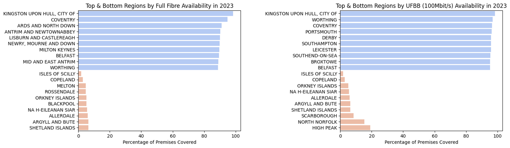
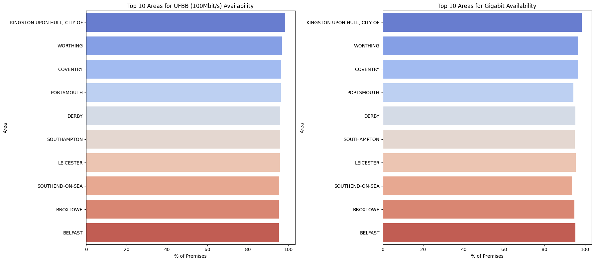
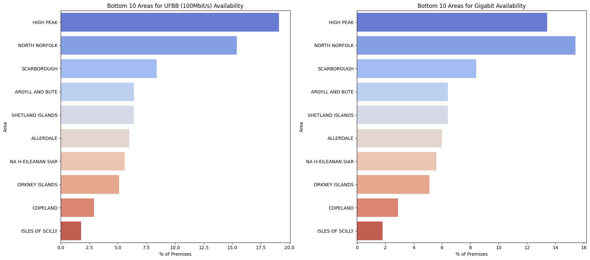
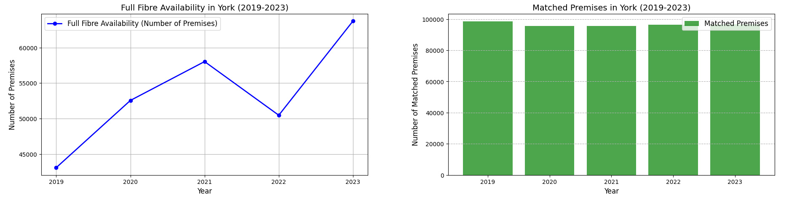

# Fixed Broadband Coverage Analysis (2019 - 2023)

# Project Background

This project examines the state of fixed broadband coverage across the UK between 2019 and 2023. The aim is to explore regional disparities, identify trends in broadband availability, and the impact of infrastructure investments on access to high-speed internet. Key metrics include:

* **Superfast Broadband (SFBB)** availability.
* **Ultrafast Broadband (UFBB)** availability.
* **Full Fibre and Gigabit Broadband** deployment.

Through this analysis, the project aims to identify patterns, gaps, and policy implications in broadband accessibility, contributing to efforts to bridge the digital divide.

# Data Structure & Initial Checks

**Data Sources:**
* Fixed broadband coverage data was sourced from Ofcom datasets spanning 2019 to 2023.
* The datasets include 374 local authorities in the UK, with 1,870 records after merging across five years.

**Initial Data Checks:**
* **Consistency:**
 _ Each dataset contains 374 entries corresponding to unique local authorities.
* All datasets were merged, verified for duplication, and augmented with a year column for temporal analysis.

* **Column Insights:**
* Key columns included broadband availability percentages, premises counts for SFBB, UFBB, Full Fibre, and premises below USO thresholds.
* Columns were standardized to ensure compatibility across years.

* **Data Cleaning Steps:**
1. * **Initial Inspection:** Ensured data completeness and absence of duplicates.
2. Removed inconsistencies in column naming and ambiguous data and ensured uniform formatting.
3. Verified data completeness by checking for missing values or anomalies.
4. Extracted meaningful subsets for targeted analysis, such as Full Fibre availability and premises below USO.
 
* **Storage:** Data was structured and stored in a MongoDB database for accessibility and further analysis. Columns included broadband availability metrics, local authority names and codes.
* **Summary:** The dataset was analysed using Pandas to verify integrity, showing clean and usable records with proper alignment across years.

# Executive Summary

### Overview of Findings

#### National Trends:

* Broadband availability across the UK has improved significantly between 2019 and 2023.
* SFBB coverage grew from **93.62% in 2019** to **96.07% in 2023**.
* UFBB availability grew significantly from **47% to 70%** over the same period.
* Full Fibre availability experienced a sharp increase, rising from **8.59% to 47.6%**.
* Gigabit broadband availability showed the most dramatic growth, increasing from **8.5% to nearly 70%**, reflecting policy-driven investment.
* Premises below USO declined substantially, reflecting improvements in access to basic broadband speeds.

#### Regional Disparities:

* Urban areas generally have higher broadband speeds and availability.
* Rural areas, especially the Orkney and Shetland Islands, show significant gaps in coverage.
* Areas like **Kingston upon Hull** and **Convetry** lead in Full Fibre and Gigabit coverage.
* Rural and island regions such as **Orkney Islands** and **Isles of Scilly** remain underserved, with minimal Full Fibre and Gigabit access.

#### Underserved Communities:
* **Orkney Islands**: SFBB availability improved from **65% in 2019** to **68.5% in 2023**, highlighting slow progress.
* Premises below USO thresholds decreased significantly across all regions after 2020.

#### Case Studies:
* **Aberdeen City**: Full Fibre availability surged **6.5 times**, from **16,410 in 2019** to **107,315 in 2023**.
* **York**: Showed a more modest increase of **1.47 times** in Full Fibre availability and a decline in matched premises by 1,966.

# Insights Deep Dive

### Regional Observations:

    

1. **Top-Performing Areas:**
* **Kingston upon Hull**: Nearly 100% coverage for Full Fibre and Gigabit broadband.
* **Coventry**: Demonstrated significant growth in UFBB and Gigabit broadband.

    

2. Least-Performing Areas:
* **Isles of Scilly**: Only **1.8% coverage for Full Fibre and Gigabit broadband**.
* **Copeland and Orkney Islands**: Limited infrastructure progress, reflecting logistical challenges.

    

### Broadband in Underserved Areas:
* Investments in rural areas remain insufficient, as demonstrated by slow growth in regions like Argyll and Bute.
* Digital inclusion policies need to prioritize these underserved communities.

### Regional Trends

* **Aberdeen City:** **Full Fibre availability** surged by **6.5 times**, growing from **16,410 premises** in **2019** to **107,315** in **2023**. Corresponding decreases were observed in premises below the Universal Service Obligation (USO) threshold, dropping nearly **5 times (189 in 2019 to 40 in 2023)**. This growth indicates robust infrastructure investment and a targeted effort to expand access to high-speed internet.

    

* **York:** In contrast to Aberdeen, York showed modest growth in broadband infrastructure. Full Fibre availability increased by just 1.47 times (from 43,077 premises in 2019 to 63,736 in 2023). Interestingly, York experienced a reduction in matched premises, with 1,966 fewer properties between 2019 and 2023. This may be due to urban redevelopment or shifting population dynamics.

    

* **Orkney and Shetland Islands:** These island regions lag significantly, with 16.7% and 16% of premises, respectively, unable to receive 10Mbit/s broadband speeds as of 2023.
Geographical challenges such as their remote locations and higher infrastructure costs likely contribute to this disparity.

    

### Broadband Type Analysis

* **Superfast Broadband (SFBB):** Nearly universal, increasing from 93.62% in 2019 to 96.07% in 2023. This modest growth reflects a mature infrastructure and focuses on improving connectivity quality rather than expanding the network. Despite high coverage, rural areas still report inconsistencies in meeting the 30Mbit/s threshold.

* **Ultrafast Broadband (UFBB):** Availability grew from 47% in 2019 to 70% in 2023, with the most significant annual increase (8.4%) observed between 2021 and 2022. The disparity between urban and rural areas is stark, as rural localities often struggle with cost-effective deployment.

* **Ultrafast Broadband (100 Mbit/s+):** One of the fastest-growing segments, jumping from an estimated 49% (inferred) in 2019 to 71.81% in 2023. Steady annual growth of approximately 5.6% indicates ongoing infrastructure upgrades, with large-scale investments aligning with government initiatives for digital inclusion.

* **Gigabit Broadband:** Showed exponential growth, from 8.5% in 2019 to 70% in 2023—a 62% increase over five years. Significant increases in 2021 and 2022 (26.37% in one year) underscore the pandemic-driven urgency to upgrade networks to meet surging demand for remote work and education.

* **Full Fibre Availability:** A parallel growth to Gigabit broadband was observed, with availability increasing from 8.59% in 2019 to 47.6% in 2023. Full Fibre's increasing importance is evident in its role as the backbone for Gigabit-capable networks.

    

### Coverage Gaps

* **Premises Below USO:** The percentage of premises unable to receive broadband speeds below 2Mbit/s, 5Mbit/s, and 10Mbit/s has steadily declined over the years. Premises below the 10Mbit/s threshold decreased from 2.1% in 2019 to 1.24% in 2023, highlighting ongoing progress but leaving notable gaps in underserved regions.

    

* **Islands and Remote Regions:** Island regions such as Orkney and Shetland face persistent challenges, with logistical and financial barriers to deploying high-speed broadband. These areas also report limited Full Fibre and Gigabit availability, reflecting infrastructure disparities.

### Observational Patterns

* **Pandemic-Driven Trends:** The sharpest increases in high-speed broadband availability (e.g., Full Fibre and Gigabit) occurred between 2020 and 2022, during the COVID-19 pandemic.
Factors contributing to this surge include remote work and education demands; reduced road traffic, facilitating quicker infrastructure deployments.

* **Urban vs Rural Divide:** Urban areas consistently exhibit higher broadband availability due to cost-efficient infrastructure deployment. Rural areas, particularly in Scotland and Wales, lag significantly, underlining the need for targeted investments.

* **Policy Impacts:** Initiatives such as the Universal Service Obligation (USO), launched in 2020, correlate with increased focus on underserved areas. Legislation and funding have accelerated improvements, particularly in regions previously unable to meet basic speed thresholds.

* **Geographic Influence: Coastal and island regions face higher deployment costs, resulting in slower progress.
* Infrastructure Focus: Investments are concentrated in urban areas, creating significant disparities.

Technological Trends:
A clear shift toward next-generation broadband (Full Fibre and Gigabit), with slower improvements in older infrastructure like SFBB.

### Reccomendations

* **Infrastructure Investments:** Prioritize underserved regions, particularly rural and island communities, to reduce digital inequality. Expand Full Fibre and Gigabit coverage to align with urban availability levels.

* **Policy Initiatives:** Incentivize broadband providers to target remote areas. Implement subsidies or public-private partnerships for high-cost infrastructure projects.

* **Monitoring and Reporting:** Establish regular updates to track progress and assess policy effectiveness. Enhance data granularity to understand local challenges better.

* Targeted Investments:
Incentivize private companies to expand infrastructure in underserved regions.
Provide subsidies or government-led initiatives for rural and island communities.
Policy Adjustments:
Set ambitious regional targets for UFBB and Gigabit broadband to bridge the digital divide.
Regularly monitor and report progress to ensure accountability.
Future Focus:
Prioritize underserved regions to ensure equitable access to next-generation broadband.
Expand public-private partnerships to accelerate infrastructure deployment.

### Assumptions and Caveats

* **Data Accuracy:** Some data points, particularly from earlier years, rely on estimations (e.g., UFBB availability in 2019).

* **Urban vs. Rural Bias:** The analysis highlights that urban areas often show higher coverage due to cost-efficient infrastructure deployment.
  
* **Limitations of Percentage Metrics:** While percentages normalize data for comparison, they may mask absolute disparities in larger or denser regions.

* External Influences:
Urban redevelopment and demographic shifts (e.g., York) may impact broadband coverage trends.
Policy Impacts:

Changes in legislation (e.g., USO launch in 2020) influence trends but may not reflect immediate infrastructure changes.
